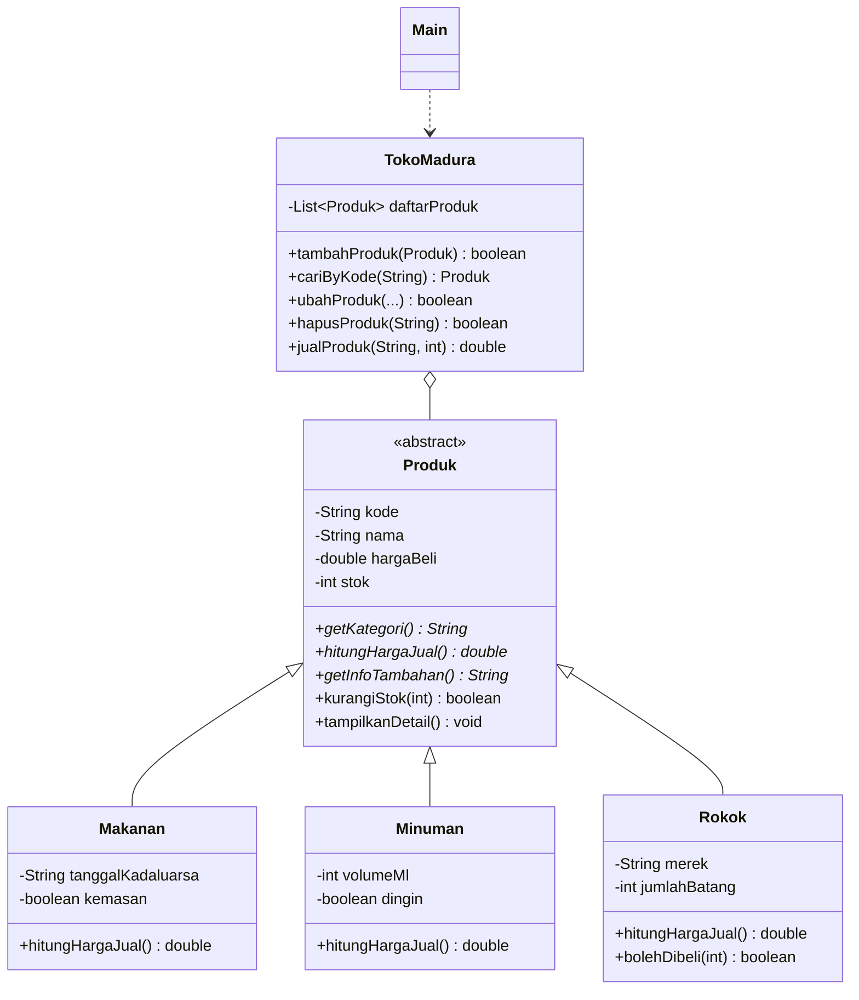

# Sistem Manajemen Toko Madura (Java CLI - OOP)

Tugas Individu Mata Kuliah **Pemrograman Berorientasi Objek**
Aplikasi berbasis konsol (Command Line Interface) yang dibangun dengan bahasa Java
dan menerapkan prinsip Pemrograman Berorientasi Objek (inheritance, polymorphism,
encapsulation, abstraction) serta dilengkapi fitur **CRUD**.

---

## 1. Identitas Mahasiswa

| Keterangan | Isi |
|---|---|
| Nama | **[TULIS NAMA LENGKAP ANDA]** |
| NIM | **[TULIS NIM ANDA]** |
| Kelas / Prodi | **[TULIS KELAS / PRODI]** |
| Mata Kuliah | Pemrograman Berorientasi Objek |
| Studi Kasus | Sistem Manajemen Toko Madura |

> Ganti bagian di dalam kurung siku dengan data Anda sebelum repository dikumpulkan.

---

## 2. Penjelasan Studi Kasus

Toko Madura adalah toko kelontong yang buka 24 jam dan menjual bermacam barang
kebutuhan harian. Pencatatan barang yang masih manual membuat pemilik toko sulit
mengetahui stok yang menipis, harga jual yang seharusnya, serta rekap penjualan.

Aplikasi ini dibuat untuk membantu pemilik toko mengelola data barang dagangan
melalui menu konsol. Barang di toko dikelompokkan menjadi tiga jenis yang punya
karakteristik dan aturan harga berbeda:

| Jenis | Atribut khusus | Aturan harga jual |
|---|---|---|
| Makanan | tanggal kedaluwarsa, kemasan/curah | harga beli + margin 15% |
| Minuman | volume (ml), dingin/suhu ruang | harga beli + margin 20% + Rp1.000 bila dingin |
| Rokok | merek, isi per bungkus | harga beli + margin 10% + cukai Rp250/batang, minimal usia pembeli 18 tahun |

Perbedaan aturan inilah yang membuat konsep **inheritance** dan **polymorphism**
benar-benar terpakai: semuanya adalah "produk", tetapi cara menghitung harga
jualnya berbeda-beda.

### Fitur Aplikasi

1. **Create** – Tambah produk baru (memilih kategori Makanan / Minuman / Rokok).
2. **Read** – Menampilkan seluruh produk dalam bentuk tabel, melihat detail satu
   produk, dan mencari produk berdasarkan nama atau kode.
3. **Update** – Mengubah nama, harga beli, stok, serta atribut khusus tiap kategori.
4. **Delete** – Menghapus produk disertai konfirmasi.
5. Transaksi penjualan: mengurangi stok otomatis, validasi usia pembeli untuk
   rokok, dan mencetak struk beserta uang kembalian.
6. Laporan toko: jumlah produk per kategori, nilai persediaan, total pendapatan,
   dan daftar produk yang perlu di-*restock*.

---

## 3. Diagram Kelas & Hierarki Class

```
                    +--------------------------+
                    |    Produk (abstract)     |   <-- SUPER CLASS
                    +--------------------------+
                    | - kode : String          |
                    | - nama : String          |
                    | - hargaBeli : double     |
                    | - stok : int             |
                    +--------------------------+
                    | + getKategori() : String        (abstract)
                    | + hitungHargaJual() : double    (abstract)
                    | + getInfoTambahan() : String    (abstract)
                    | + kurangiStok(int) : boolean
                    | + getStatusStok() : String
                    | + tampilkanDetail() : void
                    +--------------------------+
                                 ^
            (extends)            |            (extends)
        +--------------------+---+---+--------------------+
        |                    |                            |
+-----------------+  +------------------+      +--------------------+
|    Makanan      |  |     Minuman      |      |       Rokok        |   <-- SUB CLASS
+-----------------+  +------------------+      +--------------------+
| - tglKadaluarsa |  | - volumeMl : int |      | - merek : String   |
| - kemasan       |  | - dingin : bool  |      | - jumlahBatang     |
+-----------------+  +------------------+      +--------------------+
| + hitungHarga   |  | + hitungHarga    |      | + hitungHargaJual()|
|   Jual() (15%)  |  |   Jual() (20%)   |      |   (10% + cukai)    |
|                 |  |                  |      | + bolehDibeli(int) |
+-----------------+  +------------------+      +--------------------+

        +-------------------------------+              +-----------+
        |         TokoMadura            |<>----------- |  Produk   |
        +-------------------------------+  1        *  +-----------+
        | - daftarProduk : List<Produk> |
        | - totalPendapatan : double    |
        +-------------------------------+
        | + tambahProduk(Produk)   [C]  |
        | + cariByKode / cariByNama [R] |
        | + ubahProduk(...)        [U]  |
        | + hapusProduk(String)    [D]  |
        | + jualProduk(String,int)      |
        +-------------------------------+
                        ^
                        | dipakai oleh
                 +--------------+
                 |     Main     |  (menu CLI / entry point)
                 +--------------+
```

Versi Mermaid:



### Daftar File

| File | Peran |
|---|---|
| `src/Produk.java` | Super-class abstrak, atribut & perilaku umum semua produk |
| `src/Makanan.java` | Sub-class Produk |
| `src/Minuman.java` | Sub-class Produk |
| `src/Rokok.java` | Sub-class Produk |
| `src/TokoMadura.java` | Pengelola data (operasi CRUD + transaksi + laporan) |
| `src/Main.java` | Menu CLI / titik awal program |

---

## 4. Penjelasan Bagian Kode yang Menerapkan Inheritance

Relasi inheritance pada program ini adalah **`Produk` (super-class)** yang
diturunkan menjadi **`Makanan`, `Minuman`, dan `Rokok` (sub-class)** menggunakan
kata kunci `extends`.

**a. Super-class `Produk` (file `src/Produk.java`)**

```java
public abstract class Produk {
    private String kode;
    private String nama;
    private double hargaBeli;
    private int stok;

    public Produk(String kode, String nama, double hargaBeli, int stok) { ... }

    // Kontrak yang wajib diisi ulang oleh setiap sub-class
    public abstract String getKategori();
    public abstract double hitungHargaJual();
    public abstract String getInfoTambahan();

    // Perilaku umum yang langsung diwariskan
    public boolean kurangiStok(int jumlah) { ... }
    public void tampilkanDetail() { ... }
}
```

Kelas ini dibuat `abstract` karena "produk" hanyalah konsep umum; yang benar-benar
dijual di toko selalu berupa makanan, minuman, atau rokok.

**b. Sub-class memanggil constructor super-class dengan `super(...)`**

```java
public class Minuman extends Produk {
    private int volumeMl;
    private boolean dingin;

    public Minuman(String kode, String nama, double hargaBeli, int stok,
                   int volumeMl, boolean dingin) {
        super(kode, nama, hargaBeli, stok);   // atribut umum diurus super-class
        this.volumeMl = volumeMl;             // atribut khusus sub-class
        this.dingin = dingin;
    }
}
```

**c. Method overriding: aturan harga tiap sub-class berbeda**

```java
// Makanan.java
@Override
public double hitungHargaJual() {
    return Math.ceil(getHargaBeli() * 1.15 / 100.0) * 100;      // margin 15%
}

// Minuman.java
@Override
public double hitungHargaJual() {
    double harga = getHargaBeli() * 1.20;                        // margin 20%
    if (dingin) harga += BIAYA_PENDINGINAN;                      // + biaya kulkas
    return Math.ceil(harga / 100.0) * 100;
}

// Rokok.java
@Override
public double hitungHargaJual() {
    return Math.ceil((getHargaBeli() * 1.10
            + CUKAI_PER_BATANG * jumlahBatang) / 100.0) * 100;   // margin + cukai
}
```

**d. Memanggil method milik induk dengan `super.namaMethod()`**

```java
// Rokok.java
@Override
public void tampilkanDetail() {
    super.tampilkanDetail();   // memakai ulang tampilan milik super-class
    System.out.println("  Peringatan      : Dilarang menjual kepada anak di bawah umur!");
}
```

**e. Polymorphism – satu koleksi menampung semua turunan**

```java
// TokoMadura.java
private final List<Produk> daftarProduk = new ArrayList<>();

// Main.java
for (Produk p : data) {
    System.out.println(p.toBarisTabel());  // otomatis memakai aturan harga
}                                          // sesuai kelas aslinya
```

Objek `Makanan`, `Minuman`, dan `Rokok` disimpan dalam satu `List<Produk>` yang
sama. Saat `hitungHargaJual()` dipanggil, Java otomatis menjalankan versi method
milik sub-class masing-masing (*dynamic method dispatch*).

**f. Pemakaian atribut khusus sub-class dengan `instanceof`**

```java
// Main.java - validasi usia hanya berlaku untuk Rokok
if (p instanceof Rokok r) {
    int usia = bacaInt("Usia pembeli   : ");
    if (!r.bolehDibeli(usia)) {
        System.out.println("[!] Transaksi ditolak. Pembeli di bawah 18 tahun.");
        return;
    }
}
```

---

## 5. Cara Menjalankan Program

Pastikan **JDK 17 atau lebih baru** sudah terpasang (`java -version`).

```bash
# 1. Clone repository
git clone https://github.com/USERNAME/toko-madura-oop.git
cd toko-madura-oop

# 2. Compile seluruh source code ke folder out
javac -d out src/*.java

# 3. Jalankan program
java -cp out Main
```

Alternatif lewat IDE (IntelliJ IDEA / NetBeans / VS Code): buka folder project,
lalu jalankan `Main.java`.

---

## 6. Screenshot Program Berjalan

> Jalankan program di terminal, ambil screenshot, simpan di folder
> `screenshot/`, lalu tautkan di bawah ini. Minimal sertakan menu utama,
> proses Create, Read, Update, Delete, dan transaksi.

| Bagian | Screenshot |
|---|---|
| Menu Utama | `` |
| Create – Tambah Produk | `` |
| Read – Daftar Produk | `` |
| Update – Ubah Produk | `` |
| Delete – Hapus Produk | `` |
| Transaksi & Struk | `` |

(Hapus tanda backtick pada kolom Screenshot agar gambarnya tampil.)

Contoh keluaran program saat menu **Daftar Seluruh Produk** dipilih:

```
========================================================================
   TOKO MADURA BAROKAH 24 JAM
   Jl. Ir. H. Juanda No. 12, Samarinda
========================================================================
  1. Tambah Produk          (Create)
  2. Daftar Seluruh Produk  (Read)
  3. Lihat Detail Produk    (Read)
  4. Cari Produk            (Read)
  5. Ubah Data Produk       (Update)
  6. Hapus Produk           (Delete)
  7. Transaksi Penjualan
  8. Laporan Toko
  0. Keluar
========================================================================
Pilih menu [0-8] : 2

>> DAFTAR SELURUH PRODUK
KODE     NAMA PRODUK            KATEGORI       HARGA JUAL    STOK  STATUS
------------------------------------------------------------------------
MK001    Indomie Goreng         Makanan           Rp3.500      40  AMAN
MK002    Roti Sisir Mentega     Makanan           Rp9.200      12  AMAN
MK003    Gorengan Tempe         Makanan           Rp1.200       5  MENIPIS
MN001    Teh Botol Sosro 450ml  Minuman           Rp6.400      24  AMAN
MN002    Aqua Botol 600ml       Minuman           Rp3.600      36  AMAN
MN003    Kopi Susu Kaleng       Minuman           Rp9.400       4  MENIPIS
RK001    Sampoerna Mild 16      Rokok            Rp31.600      10  AMAN
RK002    Djarum Super 12        Rokok            Rp25.000       3  MENIPIS
------------------------------------------------------------------------
Total data : 8 produk
```

Contoh struk transaksi:

```
========================================
        STRUK TOKO MADURA BAROKAH 24 JAM
========================================
Sampoerna Mild 16     2 x   Rp31.600
----------------------------------------
TOTAL                           Rp63.200
TUNAI                          Rp100.000
KEMBALI                         Rp36.800
========================================
     Terima kasih, sisa stok: 8
```

---

## 7. Catatan

Data produk disimpan di memori (`ArrayList`) selama program berjalan, sesuai
lingkup tugas berbasis konsol. Pengembangan selanjutnya dapat ditambahkan
penyimpanan ke file atau database.
